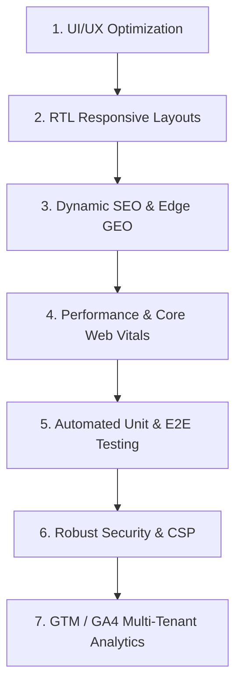

# Warattel Academy: Enterprise Testing & Enhancement Plan

This document establishes a world-class, step-by-step engineering roadmap to elevate Warattel Academy into an optimized, secure, accessible, and SaaS-ready Multi-Tenant Learning Management System (LMS).

---

## 🛠️ Dynamic SaaS Architecture: Runtime Theme Injection
To achieve white-label SaaS multi-tenancy, the application must read branding tokens (colors, logo, fonts) from the backend payload (`saas_tenant_config.json`) and apply them at runtime.

### The Implementation Strategy for Tailwind CSS v4
Since Tailwind v4 compiles inline variables (`--color-primary: var(--primary)`), we inject dynamic style sheets or set custom CSS variables on the `:root` element during boot.

```tsx
// src/components/providers/TenantThemeProvider.tsx
"use client";

import React, { useEffect } from "react";
import { SaasBrandingPayload } from "@/types/saas";

interface Props {
  branding: SaasBrandingPayload;
  children: React.ReactNode;
}

export function TenantThemeProvider({ branding, children }: Props) {
  useEffect(() => {
    const root = document.documentElement;
    const theme = branding.theme_colors;

    // Helper to map theme variables dynamically
    const applyColors = (colors: Record<string, string>, prefix = "") => {
      Object.entries(colors).forEach(([key, value]) => {
        // e.g., --primary, --background, --sidebar
        const formattedKey = `--${key.replace(/_/g, "-")}`;
        root.style.setProperty(formattedKey, value);
      });
    };

    // Apply active theme (or register listeners for dark mode switching)
    const isDark = root.classList.contains("dark");
    applyColors(isDark ? theme.dark : theme.light);
    
    // Set dynamic custom radius
    root.style.setProperty("--radius", branding.visual_settings.border_radius);

    // Apply Dynamic Font Styling (Google Fonts)
    if (branding.typography.font_sans_latin) {
      const linkId = "tenant-font-sans";
      let link = document.getElementById(linkId) as HTMLLinkElement;
      if (!link) {
        link = document.createElement("link");
        link.id = linkId;
        link.rel = "stylesheet";
        document.head.appendChild(link);
      }
      link.href = `https://fonts.googleapis.com/css2?family=${branding.typography.font_sans_latin.replace(/ /g, "+")}:wght@400;500;700&display=swap`;
      root.style.setProperty("--font-sans", `var(--font-${branding.typography.font_sans_latin.toLowerCase().replace(/ /g, "-")}), Inter, ui-sans-serif`);
    }

  }, [branding]);

  return <>{children}</>;
}
```

---

## 🚀 7-Step Testing & Enhancement Roadmap



### 1. UI/UX (User Interface & User Experience)
Elevate visual aesthetics to the highest standard with state-of-the-art interaction and strict accessibility compliance.

*   **Step 1.1: Automated Scroll-To-Error & Advanced Validation**
    *   **Method:** Combine Formik / React Hook Form with Zod schema validation.
    *   **Enhancement:** Attach a scroll listener to focus on and smooth-scroll to the first validation error field upon invalid submission. Never let users get stuck on long forms.
*   **Step 1.2: Context-Aware Submission Feedback**
    *   **Method:** Always disable submission buttons using the actual React Query `isPending` state rather than generic Formik context.
    *   **Enhancement:** Inject localized text (`جاري الحفظ...` / `Saving...`) alongside micro-loading spinners inside standard buttons, preventing multiple clicking hazards.
*   **Step 1.3: Premium Micro-Animations & Skeleton Loaders**
    *   **Tool:** `Framer Motion` + custom Tailwind transition timings.
    *   **Enhancement:** Build beautiful, shimmering CSS skeletons for every dynamic page (Student Courses, Supervisor Red Flags, Manager Audit Logs). Add subtle entrance animations (`animate-in fade-in slide-in-from-bottom-4 duration-500`) to dashboard tabs.
*   **Step 1.4: Strict Accessibility (WCAG 2.1 AA Compliance)**
    *   **Tools:** `Axe-core`, `Radix UI` / `Base UI` primitives.
    *   **Enhancement:** Enforce visible focus indicators (`focus-visible:ring-2 focus-visible:ring-primary`). Add aria roles (`aria-expanded`, `aria-controls`) to dynamic sidebars and dialogs. Support native keyboard navigation inside modals and selectors.

---

### 2. Responsive & RTL (Right-to-Left) Adaptation
Ensure the app looks flawless on all form factors while perfectly handling bidirectional layout requirements.

*   **Step 2.1: Semantic RTL Formatting (No Hardcoded Margins)**
    *   **Method:** Migrate all left/right styling to logical CSS layout structures.
    *   **Enhancement:** Replace hardcoded `ml-*`, `mr-*`, `pl-*`, `pr-*`, `left-*`, and `right-*` classes with Tailwind CSS logical properties:
        *   `ml-4` ➡️ `ms-4` (Margin Start)
        *   `pr-2` ➡️ `pe-2` (Padding End)
        *   `left-0` ➡️ `start-0`
    *   This ensures seamless Arabic (RTL) / English (LTR) transitions without duplication of styles.
*   **Step 2.2: Mobile Touch-Target Safety**
    *   **Method:** Implement responsive layout components.
    *   **Enhancement:** Upgrade all mobile navigation menus and actions to have clickable targets of at least `48px x 48px`. Utilize collapsible bottom-sheets on mobile devices instead of desktop-sized dialogs.
*   **Step 2.3: Visual Regression Testing**
    *   **Tools:** `Playwright Visual Comparisons` or `Percy`.
    *   **Enhancement:** Integrate visual comparisons in CI/CD pipeline to automatically snap views across viewport sizes (375px mobile, 768px tablet, 1440px desktop) in both Arabic and English languages.

---

### 3. SEO & GEO (Search Engine Optimization & Geographic Optimization)
Maximize organic discovery and target regional learners.

*   **Step 3.1: Next.js Dynamic Metadata API**
    *   **Method:** Dynamically generate layout-level and page-level metadata.
    *   **Enhancement:** In `[locale]/layout.tsx`, utilize metadata generators to dynamically construct titles, descriptions, and OpenGraph parameters per Tenant/Academy using tenant API settings.
*   **Step 3.2: Dynamic Hreflang Tags**
    *   **Method:** Prevent duplicate content indexing for multi-lingual subpages.
    *   **Enhancement:** Output localized link alternates inside metadata tags:
        ```html
        <link rel="alternate" hreflang="ar" href="https://academy.com/ar" />
        <link rel="alternate" hreflang="en" href="https://academy.com/en" />
        <link rel="alternate" hreflang="x-default" href="https://academy.com/ar" />
        ```
*   **Step 3.3: Dynamic Sitemaps & robots.txt Generator**
    *   **Method:** Implement Next.js Dynamic sitemaps (`sitemap.ts`).
    *   **Enhancement:** Query dynamic course pathways and blog posts, returning structured XML listing current URLs. Output customized `robots.txt` based on the tenant's privacy configuration (e.g., white-labeled private enterprise instances set to `Disallow: /`).
*   **Step 3.4: Edge Geolocation Middleware**
    *   **Method:** Optimize routing based on geographic region.
    *   **Enhancement:** Leverage edge headers (`x-vercel-ip-country`) inside Next.js Middleware. Automatically default Saudi Arabian or Gulf countries to Arabic and local currencies (SAR, AED) on their first visit.

---

### 4. Performance (Core Web Vitals Optimization)
Optimize bundle sizes, delivery times, and page responsivity to ensure lightning-fast speeds on slow mobile connections.

*   **Step 4.1: Optimizing Largest Contentful Paint (LCP)**
    *   **Method:** Next.js `next/image` optimization with resource priority.
    *   **Enhancement:** Preload high-priority assets above-the-fold (such as landing page hero banners). Set explicit width/height sizes, and configure webp/avif output formats.
*   **Step 4.2: Eliminating Cumulative Layout Shift (CLS)**
    *   **Method:** Structural aspect-ratio reservation.
    *   **Enhancement:** Enforce fixed height slots on lazy-loaded dashboards cards and widgets. Prevent layout jumping when components load async variables from API endpoints.
*   **Step 4.3: Dynamic Imports & Bundle Analysis**
    *   **Tools:** `@next/bundle-analyzer` + `next/dynamic`.
    *   **Enhancement:** Identify bloated library packages. Dynamically load heavy components only when interacted with:
        ```tsx
        const HeavyChart = dynamic(() => import("@/components/charts/HeavyChart"), {
          ssr: false,
          loading: () => <ChartSkeleton />
        });
        ```
*   **Step 4.4: Stale-While-Revalidate (SWR) Caching & ISR**
    *   **Tools:** `TanStack React Query` + dynamic route handlers.
    *   **Enhancement:** Cache static tenant configurations at edge CDNs. Enforce static regeneration (ISR) on public-facing directories and program syllabus pages, lowering database hit queries to nearly zero.

---

### 5. Automated Testing (Unit, Integration & E2E)
Build a bulletproof regression-guarding suite to enable continuous delivery.

```
       [Unit Tests: Vitest]       <-- Fast local validation (hooks, utils, slices)
               │
   [Integration: React Testing]   <-- Component behavior, form validity, state
               │
    [End-to-End: Playwright]      <-- Full client journeys (RTL layout, registration)
```

*   **Step 5.1: High-Speed Unit & Hooks Testing Suite**
    *   **Tools:** `Vitest` + `React Testing Library` + `@testing-library/react-hooks`.
    *   **Enhancement:** Secure coverage for complex logic like `useAuth`, `useRole`, language/direction handling, Redux slices (`authSlice`, `uiSlice`), and layout generators.
*   **Step 5.2: Network Mocking (MSW - Mock Service Worker)**
    *   **Tools:** `msw`.
    *   **Enhancement:** Mock all client-facing API responses at the network layer. Ensure frontend components can be fully tested under successful response conditions or failure states without calling real databases.
*   **Step 5.3: End-to-End User Journeys**
    *   **Tools:** `Playwright`.
    *   **Enhancement:** Implement automated browser tests covering critical paths:
        1.  *Student Journey:* Registering ➡️ view course ➡️ submit dynamic excuse form ➡️ receive Success visual.
        2.  *Teacher Journey:* Opening active session ➡️ checking student attendance ➡️ updating exam grades.
        3.  *Security Check:* Verifying that a `Student` role cannot view `/manager` or `/supervisor` paths (Redirects to dashboard or unauthorized screen).

---

### 6. Robust Security Policy
Exceed typical standard configurations by hardening client interfaces against attacks.

*   **Step 6.1: Fine-Grained Content Security Policy (CSP)**
    *   **Method:** Next.js route configurations or dynamic middleware CSP injections.
    *   **Enhancement:** Implement a strict CSP header script allowing resource loading *only* from verified, trusted domains, preventing cross-site scripting (XSS):
        ```http
        Content-Security-Policy: default-src 'self'; script-src 'self' 'unsafe-eval' https://www.googletagmanager.com; style-src 'self' 'unsafe-inline' https://fonts.googleapis.com; img-src 'self' blob: data: https://cdn.warattel.com; connect-src 'self' https://api.warattel.com https://*.sentry.io;
        ```
*   **Step 6.2: Hardened Cookies & Session Operations**
    *   **Method:** Server-side set cookies via API handlers.
    *   **Enhancement:** Store auth credentials inside `httpOnly`, `Secure`, and `SameSite=Lax` cookie tokens. Implement client-side CSRF token authorization on non-idempotent endpoints.
*   **Step 6.3: Runtime Output Sanitization**
    *   **Tools:** `DOMPurify` / `isomorphic-dompurify`.
    *   **Enhancement:** Enforce robust sanitization on any dynamic string rendered via `dangerouslySetInnerHTML` (such as educational library materials, course notices, or manager messages).
*   **Step 6.4: CI Dependency Security Analysis**
    *   **Tools:** `yarn audit` + Snyk.
    *   **Enhancement:** Add block-conditions inside GitHub Actions to halt builds if dependencies feature vulnerabilities graded High or Critical.

---

### 7. Google Tag Manager (GTM) & GA4 Multi-Tenant Integration
Establish structured analytics telemetry while respecting privacy guidelines and SaaS partitioning.

*   **Step 7.1: Performance-First Injection**
    *   **Tools:** `@next/third-parties/google` (`<GoogleTagManager />` & `<GoogleAnalytics />`).
    *   **Enhancement:** Load marketing scripts inside React hydration trees asynchronously, avoiding thread-blocking during initial page rendering.
*   **Step 7.2: Unified Multi-Tenant DataLayer Architecture**
    *   **Method:** Dynamically push client tags into standard event tracking schemas.
    *   **Enhancement:** On every view and interaction, push a standardized structure identifying the tenant. This allows the platform owner to report unified metrics or split metrics per tenant easily in Google Analytics 4.
    *   *Implementation Example:*
        ```typescript
        import { sendGTMEvent } from "@next/third-parties/google";

        export const trackSaaSEvent = (
          eventName: string, 
          tenantId: string, 
          payload: Record<string, any>
        ) => {
          sendGTMEvent({
            event: eventName,
            tenant_id: tenantId,
            tenant_slug: payload.slug || "unknown",
            user_role: payload.role || "anonymous",
            ...payload
          });
        };
        ```
*   **Step 7.3: Google Consent Mode v2 Compliance**
    *   **Method:** Connect custom cookie selection banners directly to Google tag structures.
    *   **Enhancement:** By default, initialize tag managers in a blocked/denied state:
        ```javascript
        gtag('consent', 'default', {
          'ad_storage': 'denied',
          'analytics_storage': 'denied'
        });
        ```
        Once a student grants consent via the cookie banner, programmatically trigger dynamic consent updates (`gtag('consent', 'update', { ... })`) to accurately capture tracking metrics.

---

## 📈 Summary of Modern Tools & Methods

| Phase | Technology / Methods | Purpose | Expected Outcome |
| :--- | :--- | :--- | :--- |
| **UI/UX** | Radix UI, Formik/Zod, Scroll-To-Error | Perfect input loops, 100% form completion loops | High satisfaction, zero form block frustrations |
| **Responsive** | Logical properties (`ms-*`, `pe-*`), Playwright | Perfect RTL flip visual verification | Flawless display in both AR and EN layouts |
| **SEO & GEO** | Next.js Metadata API, dynamic alternates, Geo-routing | Multi-lingual search visibility & geo defaults | Dynamic, multi-tenant discoverability |
| **Performance** | `next/image`, Dynamic Imports, ISR caching | Optimize Core Web Vitals (LCP, CLS, INP) | sub-second load times on mobile devices |
| **Testing** | Vitest, MSW, Playwright visual | Complete coverage of logical & browser workflows | Zero regression bugs, confident deployments |
| **Security** | Dynamic CSP, DOMPurify, HttpOnly Cookies | Harden app and API proxies from vulnerabilities | Strict protection of student & academy records |
| **Analytics** | `@next/third-parties`, Consent Mode v2 | Track cross-tenant conversions cleanly | Multi-tenant analytics partitioned by Tenant ID |

---

> [!NOTE]
> All backend variables configured in `docs/saas_tenant_config.json` should be fetched during initial render context (SSR layout loaders) to prevent styling flickers when the client receives white-labeled colors.
